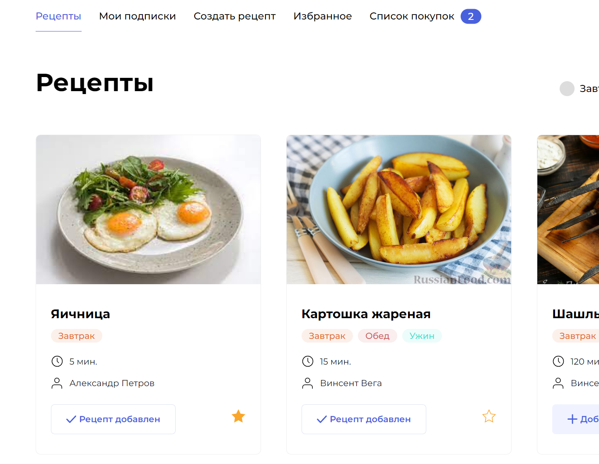

### Проект Foodgram

Проект Foodgram создан для публикации рецептов. Авторизованные пользователи могут подписываться на понравившихся авторов, создавать рецепты, добавлять рецепты в избранное, в покупки, скачать список покупок ингредиентов для добавленных в покупки рецептов.

  

## Подготовка и запуск проекта
Склонировать репозиторий на локальную машину:
```python
git clone https://github.com/feym4n-git/foodgram-project
```
### Для работы с удаленным сервером (на ubuntu):

Выполните вход на свой удаленный сервер

Установите docker на сервер:
```python
sudo apt install docker.io 
```
Установите docker-compose на сервер:
```python
sudo curl -L "https://github.com/docker/compose/releases/download/1.29.2/docker-compose-$(uname -s)-$(uname -m)" -o /usr/local/bin/docker-compose
sudo chmod +x /usr/local/bin/docker-compose
```
Локально отредактируйте файл gateway/nginx.conf и в строке server_name впишите свой IP

Cоздайте .env файл и впишите:

```python
DB_NAME=<имя базы данных postgres>
DB_USER=<пользователь бд>
DB_PASSWORD=<пароль>
DB_HOST=<db>
DB_PORT=<5432>
SECRET_KEY=<секретный ключ проекта django>

```

Для работы с Workflow добавьте в Secrets GitHub переменные окружения для работы:

DOCKER_PASSWORD=<пароль от DockerHub>
DOCKER_USERNAME=<имя пользователя>
SECRET_KEY=<секретный ключ проекта django>
USER=<username для подключения к серверу>
HOST=<IP сервера>
PASSPHRASE=<пароль для сервера, если он установлен>
SSH_KEY=<ваш SSH ключ (для получения команда: cat ~/.ssh/id_rsa)>

Workflow состоит из трёх шагов:

1. Проверка кода на соответствие PEP8
2. Сборка и публикация образа бекенда на DockerHub.
3. Автоматический деплой на удаленный сервер.

После выполнения git-actions на сервере:

Загрузите ингридиенты в базу данных (необязательно):

```python
sudo docker-compose -f docker-compose.production.yml exec backend python manage.py loaddata ingridients_new.json
```
Создать суперпользователя Django:
```python
sudo docker-compose -f docker-compose.production.yml exec backend python manage.py createsuperuser
```
Проект будет доступен по вашему IP
